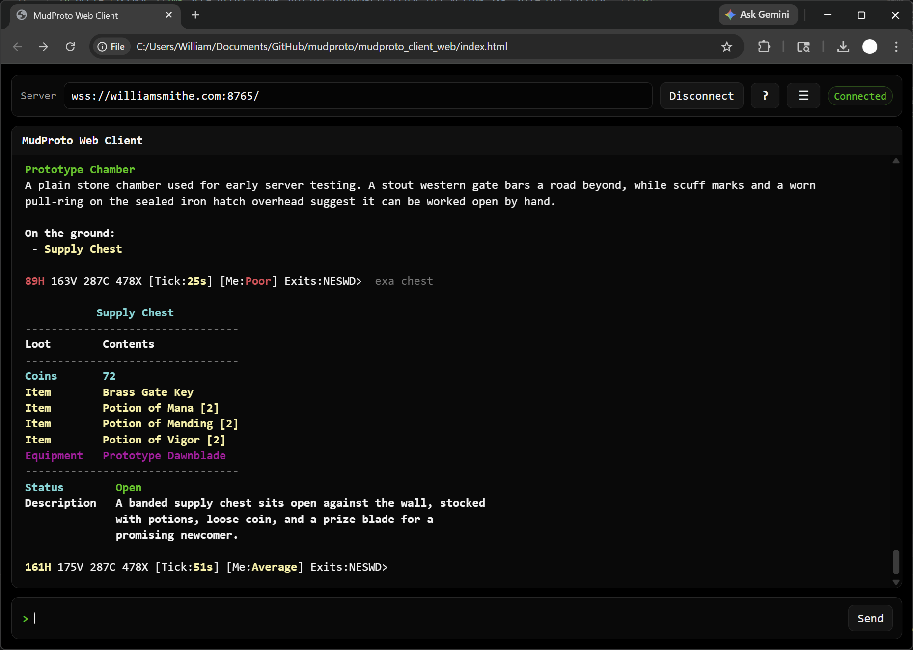

<h1 align="center">MudProto</h1>

<p align="center">
  A customizable, extensible, server-authoritative MUD framework built in Python.
</p>

<p align="center">
  <a href="LICENSE"></a>
  <a href="https://python.org"></a>
  <a href="https://websockets.readthedocs.io"></a>
  <a href="https://sqlite.org"></a>
  <a href="https://github.com/WilliamSmithEdward/mudproto/actions/workflows/ci.yml"></a>
</p>

<p align="center"><strong>Play MudProto live in your browser</strong></p>

<p align="center">
  <a href="https://williamsmithedward.github.io/mudproto/mudproto_client_web/">
    
  </a>
</p>

<p align="center">
  <strong>Live demo.</strong> No install required.
</p>

<p align="center">
  
</p>

## Quick Start

```bash
# Clone
git clone https://github.com/WilliamSmithEdward/mudproto.git
cd mudproto

# Create and activate virtual environment
python -m venv venv
venv\Scripts\activate          # Windows
# source venv/bin/activate     # macOS/Linux

# Install runtime dependencies
pip install -r requirements.txt

# Start server
python mudproto_server/core_logic/server.py

# Open the web client
start mudproto_client_web/index.html      # Windows
# open mudproto_client_web/index.html     # macOS
# xdg-open mudproto_client_web/index.html # Linux
```

Note: MudProto is now web-first. The old terminal path is gone, and the desktop Python GUI has been retired.

First commands to try:

- start
- look
- score
- inventory
- scan

## Web-first direction

MudProto now treats the browser client as the primary player interface to avoid maintaining two different clients.

That means:

- new client UX work should go into mudproto_client_web
- client-side settings and quality-of-life features should be added in the web client
- the retired Python GUI should not be brought back as a second actively maintained front end

## Current Gameplay Highlights

### Combat and Abilities

- Multi-target room combat with shared round output.
- Skills and spells with round cooldowns and optional game-hour cooldowns.
- Timed and battle-round support effects.
- NPC ability usage with independent skill/spell cooldown tracking.
- Bash-style target lag now also forces target posture to sitting.

### Posture System

- Postures: standing, sitting, resting.
- Commands:
  - sit aliases: si, sit
  - rest aliases: r, re, res, rest
  - stand aliases: st, sta, stan, stand
- Sitting and resting can block movement using posture config flags.
- Posture damage multipliers are data-driven from posture config.
- Resting can apply regeneration bonus multipliers.
- Room look output shows posture for living NPCs and players.
- Score output shows current posture state.

### Social and Grouping

- Follow, watch, group flows.
- Swap command supports self/member and member/member reorder patterns.
- Follow/group behavior reconciles correctly on death and movement.

### Persistence, Items, and World

- SQLite-backed player persistence.
- Shared room state for NPCs, corpses, coin piles, and ground items.
- Corpses now follow the same shared container rules as other lootable containers.
- Potions are modeled directly with item_type values and support both use and quaff-style aliases.
- JSON-driven content for rooms, zones, NPCs, items, spells, skills, and attributes.
- Server runtime and presentation config is split under [mudproto_server/configuration/server/settings.json](mudproto_server/configuration/server/settings.json), [mudproto_server/configuration/server/directions.json](mudproto_server/configuration/server/directions.json), [mudproto_server/configuration/server/health_conditions.json](mudproto_server/configuration/server/health_conditions.json), [mudproto_server/configuration/server/display_feedback.json](mudproto_server/configuration/server/display_feedback.json), and [mudproto_server/configuration/server/display_colors.json](mudproto_server/configuration/server/display_colors.json).

## Architecture

Clients send raw text commands. The server owns all game logic and returns structured display envelopes.

See [ARCHITECTURE.md](ARCHITECTURE.md) for a deeper technical breakdown.

## AI Content Pipeline

MudProto supports LLM-assisted asset bundle generation.

Main entrypoint:

- mudproto_llm_interfaces/generate_asset_payload_generation_instructions.py

Generated instruction payload:

- mudproto_llm_interfaces/asset_payload_generation_instructions.json

Typical workflow:

1. Regenerate instruction payload.
2. Provide payload plus a content brief to an AI model.
3. Save returned JSON payload under mudproto_server/configuration/assets/asset_payloads/.
4. Restart server to load new content.

Full process details: [LLM_CONTENT_GENERATION.md](LLM_CONTENT_GENERATION.md).

## Project Layout

```text
mudproto/
├── ARCHITECTURE.md
├── ASSET_GENERATION.md
├── LLM_CONTENT_GENERATION.md
├── mudproto_client_web/
│   ├── index.html
│   └── documentation/
├── mudproto_llm_interfaces/
│   ├── generate_asset_payload_generation_instructions.py
│   └── asset_payload_generation_instructions.json
├── mudproto_server/
│   ├── configuration/
│   │   ├── server/
│   │   │   ├── settings.json
│   │   │   ├── directions.json
│   │   │   ├── health_conditions.json
│   │   │   ├── display_feedback.json
│   │   │   └── display_colors.json
│   │   ├── assets/
│   │   └── attributes/
│   └── core_logic/
│       ├── server.py
│       ├── command_handlers/
│       └── tests/
├── images/
└── README.md
```

## Development Notes

- Python version target: 3.12+
- Runtime dependencies are tracked in requirements.txt
- Development/test dependencies are tracked in requirements-dev.txt
- Core test suite lives under mudproto_server/core_logic/tests

### Development Setup

```bash
# From repo root (with venv active)
pip install -r requirements-dev.txt
```

Recommended local workflow:

1. Keep your virtual environment in venv/ (already gitignored).
2. Install runtime deps with requirements.txt for game-only usage.
3. Install requirements-dev.txt when running tests regularly.
4. Use python -m pytest from mudproto_server/core_logic for full regression runs.
5. GitHub Actions CI runs pytest automatically on pushes to main and on pull requests.

Run tests:

```bash
cd mudproto_server/core_logic
python -m pytest
```

MudProto is designed to be practical to run, straightforward to read, and easy to extend.

<p align="center"><sub>────────────</sub></p>

<p align="center"><em>Roll for initiative.</em> 🎲</p>
